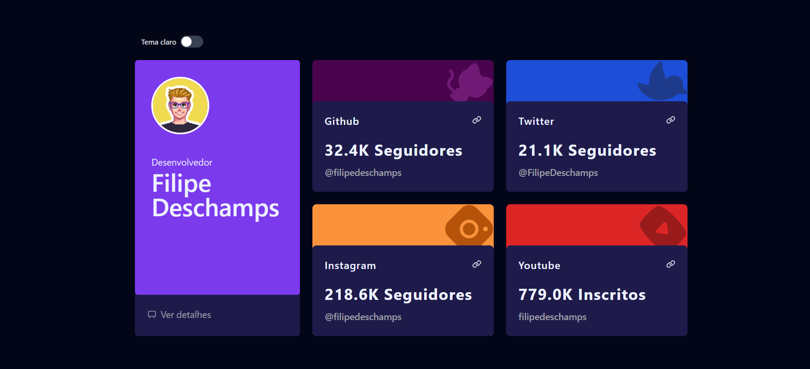
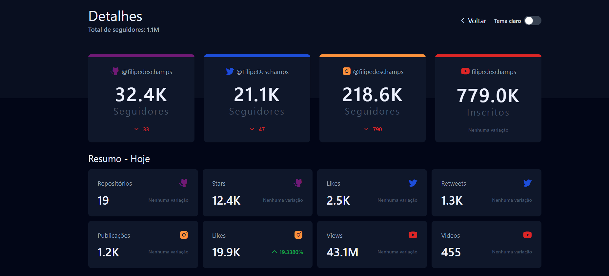

<h1 align="center">
  Dev Media 👨‍💻
</h1>

<div align="center">
   <a href="https://github.com/JohnPetros">
    
   </a>
   
   <a href="https://github.com/JohnPetros/dev-media/commits/main">
    
   </a>
  </a>
   </a>
   <a href="https://github.com/JohnPetros/dev-media/blob/main/LICENSE.md">
    
   </a>
    
</div>
<br>

## 🖥️ Sobre o Projeto

**Dev Media** é um **site web** que informa as métricas do [Github](https://github.com/), [Instagram](https://www.instagram.com/), [Twitter](https://x.com/?lang=pt-br) (eu me recuso a chamá-lo de X) e [Youtube](https://www.youtube.com/?app=desktop&hl=pt) de um desenvolvedor popular na comunidade, sendo **Filipe Deschamps**, **Gustavo Guanabara** ou **Fábio Akita**.

Na página inicial é exibido a quantidade de seguidores de cada uma das redes sociais do desenvovedor, enquanto na página secundária é exibido isso e mais outras métricas das respectivas plataformas.

O objetivo ao realizar esse projeto foi aprender o conceito de [Proxy Reverso](https://www.f5.com/pt_br/glossary/reverse-proxy) e [Load Balacing](https://www.monitoratec.com.br/blog/load-balance/) utilizando Nginx. Nesse caso, utilizei 4 containers Docker uma para ser o servidor web, outro para servir o banco de dados e os demais para ser a aplicação em si (cada uma delas imforma as respectivas métricas de cada um dos desenvolvedores citados).

Além disso, esse projeto é inspirado em ambos os desafios [Time tracking dashboard](https://www.frontendmentor.io/challenges/time-tracking-dashboard-UIQ7167Jw) e [Social media dashboard with theme switcher](https://www.frontendmentor.io/challenges/social-media-dashboard-with-theme-switcher-6oY8ozp_H) do [Frontend Mentor](https://www.frontendmentor.io/), uma plataforma online e gratuita para desenvolvedores melhorarem suas habilidades no Frontend.


### ⏹️ Demonstração

<table align="center">
  <tr>
    <td align="center">
    <span>Página inicial<br/><br/></span>
    
    </td>
  </tr>
  <tr>
    <td align="center">
    <span>Página de detalhes<br/><br/></span>
    
    </td>
  </tr>
</table>

---

## ✨ Funcionalidades

### Pagina inicial

- [x] Deve ser exibido 4 widgets sendo que em cada um deve conter 
  - Número de seguidores do Github
  - Número de seguidores do Twitter
  - Número de seguidores do Instagram
  - Número de inscritos do Youtube
  - Link para levar o usuário diretamente para a conta do desenvolvedor da respectiva rede social
- [x] Deve ser exibido o avatar de um avatar do densenvolvedor, juntamente com o seu nome.
- [x] Deve ser disponibilizado um link para a página de detalhes.

### Pagina de detalhes

- [x] Deve ser exibido os widgets da página inicial
- [x] Deve ser exibido total de seguidores/incritos considerando todas as redes sociais do desenvolvedor
- [x] Deve ser exibido em forma de cards as seguintes informações:
  - Quantidade de repositórios no Github 
  - Quantidade de Stars no Github 
  - Quantidade de likes no Twitter
  - Quantidade retweets no Twitter
  - Quantidade de publicações no Instagram
  - Quantidade de likes no Instagram
  - Quantidade de views no Youtube
  - Quantidade de videos no Youtube
- [x] Cada widget deve informar a variação absoluta com relação ao dia anterior 
- [x] Cada card deve informar a variação percentual com relação ao dia anterior

### Proxy reverso

- [x] Caso o usuário acesse uma rota contendo o nome do desenvolvedor, ex.: `/akita`, ele deve ser redirecionado para a aplicação referente a ao desenvolvedor **Akita**.

### Loading Balancing

- [x] A cada vez que o usuário recarregar a página, ele deve ser direcionado para a aplicação de outro desenvolvedor.
- [x] Todas as aplicações devem ter o mesmo peso no load balancing, ou seja todo o número de requests deve ser igualmente distribuído entre elas.

### Banco de dados

- [x] As tabelas deve ser criadas automaticamente ao iniciar a aplicação
- [x] Os dados referentes aos desenvolvedores devem ser inseridos automaticamente ao iniciar a aplicação
- [x] As métricas a serem exibidas deve ser reais, ou seja, devem ser providas de serviços externos a aplicação
- [x] As métricas providas externamente a aplicação devem ser inseridos no banco de dados a cada 10 minutos

### Light/Dark Mode

- [x] O usuário pode escolher o tema da aplicação (light ou dark) 
- [x] O padrão deve ser dark mode
- [x] O tema escolhido deve ser armazado no navegador de tal forma que mesmo se o usuário recarregar a página o tema escolhido deve ser selecionado automaticamente

---

## ⚙️ Arquitetura

## 🛠️ Tecnologias, ferramentas e serviços externos

Este projeto foi desenvolvido usando as seguintes tecnologias:

- **[Python](https://www.python.org/)** para programar o backend

- **[Flask](https://flask.palletsprojects.com/en/3.0.x/)** Para ser o servidor web da aplicação

- **[Peewee](https://docs.peewee-orm.com/en/latest/)** Para consultar e manipular dados o banco de dados (ORM)

- **[Ngnix](https://nginx.org/en/)** para ser o proxy reverso e aplicar o load balancing

- **[SQLite](https://sqlite.org/)** Para servir como banco de dados de teste

- **[PostgreSQL](postgresql)** - para servir como banco de dados de produção

- **[TailwindCSS](https://tailwindcss.com/)** - para estilizar as templates HTML

- **[HTML](https://developer.mozilla.org/pt-BR/docs/Web/HTML)** - Para construir os templates da aplicação

- **[JavaScript](https://developer.mozilla.org/pt-BR/docs/Web/JavaScript)** - Para fazer  funcionalidade de light/dark mode

- **[Docker](https://www.docker.com/)** - para criar e gerenciar os containers do Nginx, das aplicações e do banco de dados

- **[Github Rest API](https://docs.github.com/pt/rest?apiVersion=2022-11-28)** - para buscar dados públicos de um perfil do Github

- **[Rettiwt API](https://docs.github.com/pt/rest?apiVersion=2022-11-28)** - para buscar dados públicos de um perfil do Twitter 

- **[Youtube API](https://developers.google.com/youtube/v3?hl=pt-br)** - para buscar dados públicos de um canal do Youtube

> Para mais detalhes acerca das dependências do projeto, como versões específicas, veja o arquivo [package.json](https://github.com/JohnPetros/dev-media/blob/main/package.json) do projeto.

---

## 🚀 Como rodar a aplicação?

### 🔧 Pré-requisitos

Antes de baixar o projeto você necessecitará ter instalado na sua máquina as seguintes ferramentas:

- [Git](https://git-scm.com/) para manilupar repostitórios Git
- [Docker](https://docs.docker.com/get-docker/) para manipular Docker containers

> Além disto é bom ter um editor para trabalhar com o código, como o [VSCode](https://code.visualstudio.com/).

> Além disto é crucial configurar as variáveis de ambiente em um arquivo chamado `.env` antes de executar a aplicação. veja o arquivo [.env.example](https://github.com/JohnPetros/dev-media/blob/main/.env.example) para ver quais variáveis devem ser configuradas.

### 📟 Rodando a aplicação

```bash

# Clone este repositório
$ git clone https://github.com/JohnPetros/dev-media.git

# Acesse a pasta do projeto
$ cd dev-media

# Rode os containers do projeto
$ docker compose up

```

> Muito provavelmente a aplicação estará rodando no endereço http://localhost:8000

---

## 💪 Como contribuir

```bash

# Fork este repositório
$ git clone https://github.com/JohnPetros/dev-media.git

# Cria uma branch com a sua feature
$ git checkout -b minha-feature

# Commit suas mudanças:
$ git commit -m 'feat: Minha feature'

# Push sua branch:
$ git push origin minha-feature

```

> Você deve substituir 'minha-feature' pelo nome da feature que você está adicionando.

> Utilize [minha tabela de emojis para cada tipo de commit](https://gist.github.com/JohnPetros/1f63f8cf07c719c5d2c5e011e2eac770) para manter o padrão entre as mensagens de commit. 

> Você também pode abrir um [nova issue](https://github.com/JohnPetros/dev-media/issues) a respeito de algum problema, dúvida ou sugestão para o projeto. Ficarei feliz em poder ajudar, assim como melhorar este projeto.

---

## 📝 Licença

Esta aplicação está sob licença do MIT. Consulte o [Arquivo de licença](LICENSE) para obter mais detalhes sobre.

---

<p align="center">
  Feito com 💜 por John Petros 👋🏻
</p>
